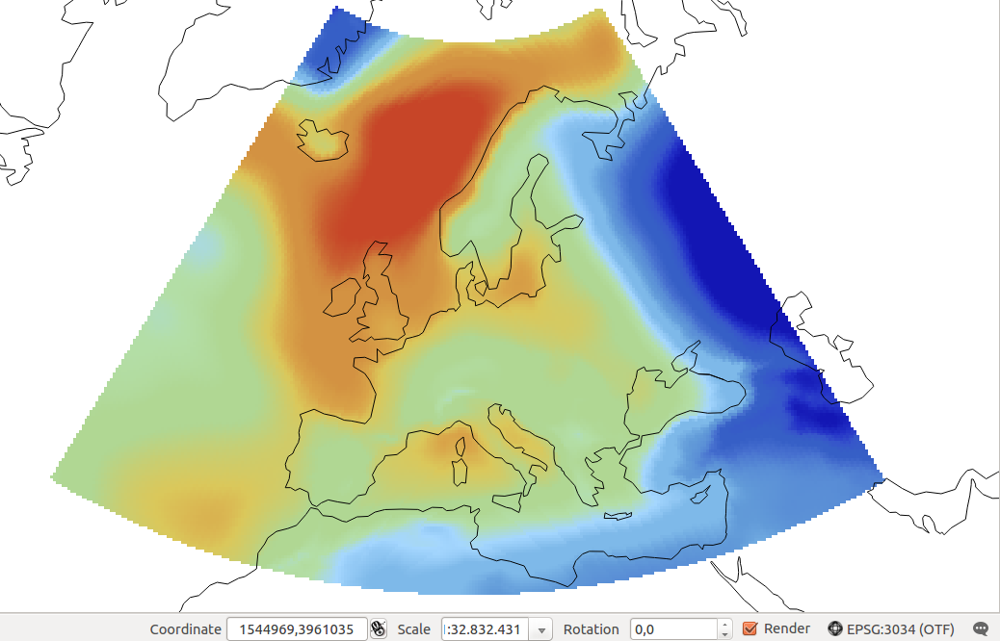

# Final raster exercise

Input data:
- data/mslp_gfs/mslp_europe.nc
- NetCDF dataset.
- Source dataset: subsetted and translated NOAA GFS Grib data.
- Source dataset unit: Pa

Results:
- Translate NetCDF dataset to GeoTiff.
- Destiny CRS: ETRS89 / LCC Europe (EPSG:3034).
- Destiny dataset unit: hPa

Solved practical exercise:
[mslpeurope.py](mslpeurope.py)

